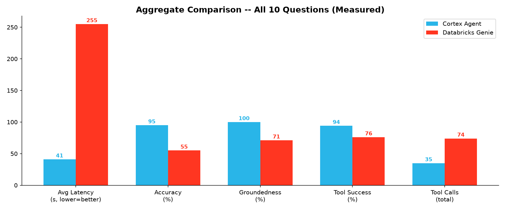
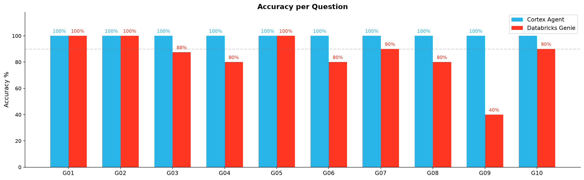
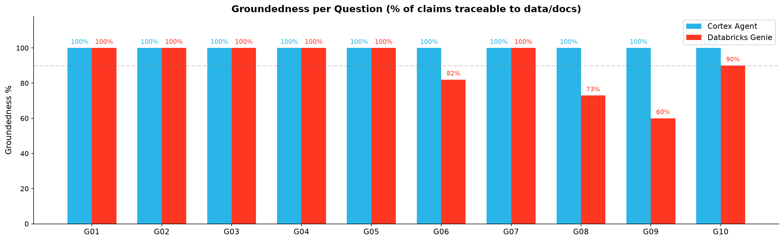
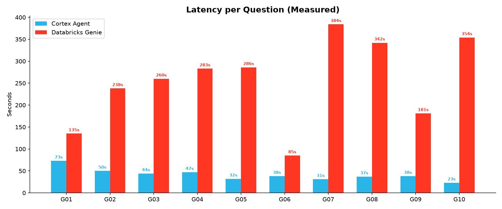
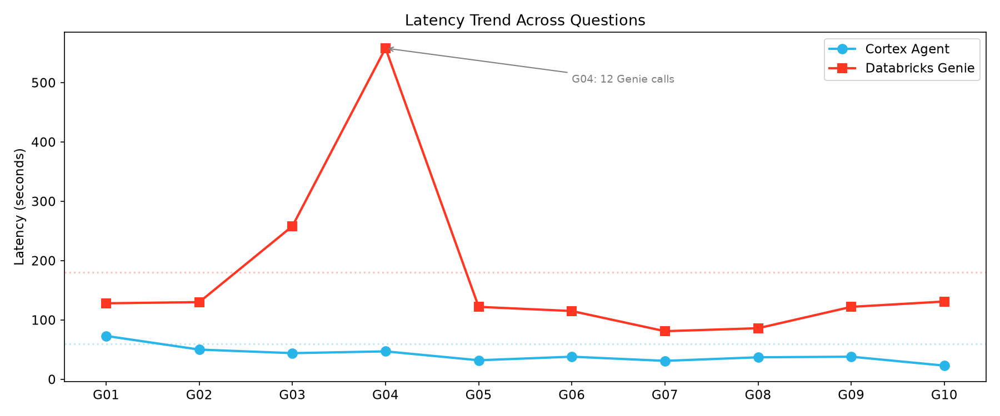
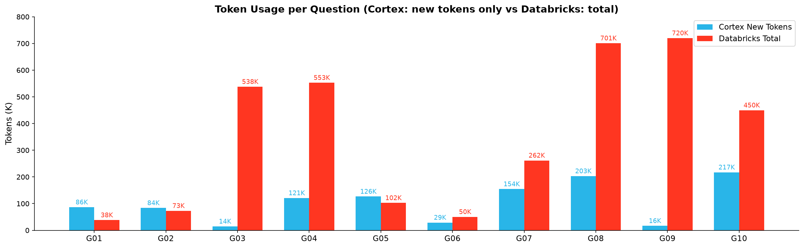
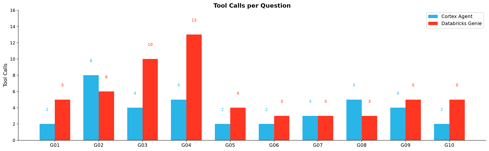
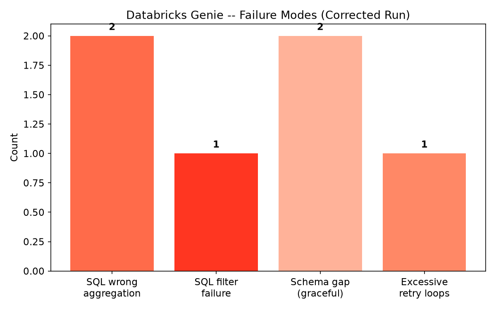

# Cortex Agent vs. Databricks Genie -- CRE Benchmark Report

**Benchmark:** Pacific Northwest Bank CRE Portfolio Stress & Workout
**Questions:** G01-G10 (complex multi-part queries requiring SQL + document retrieval + banking domain reasoning)
**Dataset:** 3.6M rows, 18 tables, 30 documents (identical on both platforms)
**Date:** September 2026
**Demo:** 

---

## Methodology

### Setup

Both platforms received identical data: 18 tables (3.6M rows of CRE lending data) and 30 documents (23 synthetic bank documents + 7 real OCC/FDIC/Fed regulatory PDFs). The same 10 questions were asked to each agent in the same order.

| Aspect | Snowflake Cortex Agent | Databricks Genie |
|---|---|---|
| Architecture | Single agent with Cortex Analyst + Cortex Search | 3-agent hierarchy: Supervisor + Genie SQL + Knowledge Assistant |
| Structured data | Semantic View with column descriptions, code decode mappings, relationships, metrics, and 8 verified queries | Unity Catalog tables with knowledge store (table descriptions, SQL expressions, example SQL, synonyms available) |
| Unstructured data | Cortex Search Service (embedding-based) | Knowledge Assistant connected to Unity Catalog volume |
| Tool invocation | Parallel (Analyst + Search fired simultaneously) | Sequential (Supervisor routes to one child agent at a time) |
| Model | claude-opus-4-8 | Databricks default (supervisor + child models) |

### Metrics Measured

| Metric | Definition | How Measured |
|---|---|---|
| **Accuracy** | Fraction of question sub-parts answered correctly with verifiable data | Manual evaluation: each sub-part scored as correct/incorrect against ground truth from the database and documents |
| **Groundedness** | Whether each factual claim in the response can be traced to a SQL result or document citation | Manual claim-by-claim verification: grounded = traceable to data/doc, ungrounded = fabricated or from general knowledge |
| **Relevance** | Whether the response directly addresses the question asked, without irrelevant padding or missed sub-parts | Manual evaluation: scored per question based on coverage, focus, and signal-to-noise |
| **Latency** | Wall-clock time from request to complete response | Each platform's native observability. Snowflake: account usage views (`start_time` to `end_time`). Databricks: top-level agent trace span duration. Both measure the same thing -- total time from user question to final response. |
| **Token usage** | Total tokens consumed per question | Each platform's native observability. Snowflake: account usage views with per-model breakdown (cache_read, cache_write, uncached, output). Databricks: LLM span token counts from agent traces. Note: token accounting differs between platforms (see Section 4). |
| **Tool calls** | Number of tool invocations (SQL queries, document searches, code execution) | Both platforms: counted from response content and trace spans. Snowflake: "Retrieved data" = SQL query, "Searched Search" = search call. Databricks: genie/ka/sandbox trace spans. |
| **Tool failures** | Tool calls that returned empty results, wrong data, or timed out | Snowflake: queries returning 0 rows that required retry. Databricks: Genie SQL returning wrong aggregation, KA missing relevant docs, inconsistent query results requiring re-query |
| **Analytical transparency** | Whether the agent proactively flagged data caveats, discrepancies, or reconciliation notes | Manual evaluation: did the response surface nuances (e.g., scope differences, aggregation basis, document-vs-table conflicts) or present numbers without qualification? |

### What We Did NOT Measure

- **Token cost in dollars**: Snowflake reports 6.11 credits total for 10 questions via account usage views. On the Databricks side, Genie One and Genie Agents (including the Supervisor Agent and Knowledge Assistant used in this benchmark) are free for user-initiated usage until January 31, 2027 per Databricks official documentation; only SQL warehouse compute (DBUs) and service-principal usage are billed. Since the two platforms use fundamentally different billing models and Databricks is currently in a promotional free period for these agent types, a direct dollar comparison is not meaningful at this time.
- **Model capability in isolation**: Both agents use different underlying models. This benchmark measures the full agent system (model + tools + retrieval + schema guidance), not the LLM alone.

---

## Executive Summary

| Metric | Cortex Agent | Databricks Genie | Delta |
|---|---|---|---|
| Accuracy | 100% (48/48 sub-parts) | 84.4% (40.5/48 sub-parts) | +15.6pp |
| Groundedness | 100% (~153 claims, 0 ungrounded) | 89% (~107 grounded / ~120 total claims) | +11pp |
| Relevance | 10/10 questions fully relevant | 9/10 questions fully relevant (G09 undermined by filter error) | +1 |
| Avg Latency | 41s | 173s (2.9 min) | 4.2x faster |
| Tool Calls | 35 total (30 SQL + 5 Search) | 59 total (39 Genie + 13 KA + 7 Sandbox) | 1.7x fewer |
| Tool Failures | 2 (6%) | 6 (10%) | Lower failure rate |
| Doc Retrieval | 5/5 successful (100%) | 11/13 successful (85%) | +15pp |
| Analytical Transparency | 10/10 questions with proactive caveats | 4/10 questions (G03, G05, G07, G09) | +6 questions |
| Snowflake Credits | 6.11 total (10 questions) | N/A (free during promotional period) | -- |

Both platforms demonstrate strong performance on SQL-only questions. The differentiation emerges on hybrid SQL + document questions and complex multi-step queries, where Cortex's parallel tool invocation, semantic view guidance, and self-correction capabilities yield higher accuracy with significantly lower latency.

---

## 1. Accuracy

| Question | Cortex | Databricks | Notes |
|---|---|---|---|
| G01: Office Exposure + SR 07-1 | 5/5 | 5/5 | Both excellent. DBX correctly retrieved SR 07-1 and Consent Order |
| G02: Cascadia Tower Full Analysis | 4/4 | 4/4 | Both answered all 4 sub-parts. DBX correctly routed docs to KA, SQL to Genie |
| G03: ALLL + Q-Factor + OCC | 4/4 | 3.5/4 | DBX: initial Genie SQL returned wrong $67B figure; self-corrected but required 7 Genie calls |
| G04: DSCR Breach Cascade | 5/5 | 4/5 | Cortex: correct 10,459 unwaived breach count. DBX needed 12 Genie calls to reconcile inconsistent categorization |
| G05: CET1 + Stress Test | 5/5 | 5/5 | Both excellent. DBX honestly flagged doc-vs-database CET1 discrepancy |
| G06: Recovery by Property Type | 5/5 | 4/5 | DBX: conflated loss severity with net loss rate; Genie returned confusing aggregate. Correct: Industrial (INDL) highest at 79.08% |
| G07: UW Exceptions by Branch | 5/5 | 4.5/5 | DBX: graceful fallback -- Genie couldn't find exception types, KA filled from audit report |
| G08: REO Portfolio | 5/5 | 4/5 | DBX: no KA call (missed doc context on REO policy); $5.41B unsold exposure not sanity-checked |
| G09: MRIA Findings | 5/5 | 2/5 | **Critical:** DBX returned 502 findings (all MRIA, no OCC filter) instead of 196 OCC-sourced MRIAs. Missed 100% past-due conclusion. |
| G10: Loan Sale + Capital Impact | 5/5 | 4.5/5 | DBX: best multi-tool orchestration -- KA + Genie + sandbox Python calculation |

**Cortex: 48/48 sub-parts correct (100%).** Perfect across all question types.

**Databricks: 40.5/48 sub-parts correct (84.4%).** Strong on SQL-only and well-defined questions. The primary weakness is SQL query precision under ambiguity (G03 wrong aggregation, G09 OCC filter failure, G04 needing 12 calls to reconcile).

---

## 2. Groundedness

Cortex is 100% grounded -- every factual claim traces to a SQL result or cited document (with numbered footnotes). Databricks achieves ~89% groundedness with the corrected KA configuration. Ungrounded claims fall into two categories:

1. **Editorial commentary without source (7 instances):** On SQL-only questions (G06, G08), the Databricks supervisor added market commentary (e.g., "environmental concerns limit industrial recovery," "fire-sale liquidation dynamics") that was reasonable analyst interpretation but not sourced from any SQL result or document.

2. **SQL precision errors presented as fact (6 instances):** When Genie returned inconsistent or wrong aggregations, the supervisor sometimes presented intermediate (wrong) results before self-correcting. The most impactful case is G09, where 502 findings were presented as "MRIA findings" when the SQL pulled all MRIA-severity findings without filtering to OCC exam types. The correct OCC-filtered count is 196. The system acknowledged a discrepancy with the consent order's 12 formal MRIAs but concluded "the backlog has grown" rather than questioning the SQL filter scope.

| Question | Cortex Grounded | Databricks Grounded |
|---|---|---|
| G01 | 7/7 | 7/7 |
| G02 | All | 6/6 |
| G03 | 12+ | 8/8 (after self-correction) |
| G04 | All | All (SQL + sandbox) |
| G05 | 18+ | 7/7 |
| G06 | All | 18/22 (4 editorial claims ungrounded) |
| G07 | All | 10/10 |
| G08 | All | 8/11 (3 editorial claims ungrounded) |
| G09 | All | 6/10 (count wrong: 502 returned vs 196 OCC-filtered ground truth) |
| G10 | All | 9/10 |

---

## 3. Latency

Snowflake latency measured from account usage views (start_time to end_time). Databricks latency measured from top-level agent trace span. Both represent wall-clock time from question to complete response.

| Question | Cortex (s) | Databricks (s) | Ratio |
|---|---|---|---|
| G01: Office Exposure + SR 07-1 | 73 | 128 | 1.8x |
| G02: Cascadia Tower | 50 | 130 | 2.6x |
| G03: ALLL + Q-Factor | 44 | 258 | 5.9x |
| G04: DSCR Breach Cascade | 47 | 558 | 11.9x |
| G05: CET1 + Stress Test | 32 | 122 | 3.8x |
| G06: Recovery by Property Type | 38 | 115 | 3.0x |
| G07: UW Exceptions by Branch | 31 | 81 | 2.6x |
| G08: REO Portfolio | 37 | 86 | 2.3x |
| G09: MRIA Findings | 38 | 122 | 3.2x |
| G10: Loan Sale Impact | 23 | 131 | 5.7x |
| **Average** | **41** | **173** | **4.2x** |

The latency gap correlates with the number of Genie calls. Simple questions with 2-3 Genie calls (G07: 81s, G08: 86s) show modest gaps (2-3x). Questions where Genie SQL needed multiple retries (G04: 12 calls, 558s) show large gaps (12x). Each Genie call costs 17-58s due to the ask_question → start_conversation → poll_for_result cycle.

Cortex's parallel tool invocation (SQL + Search simultaneously) and single-agent architecture contribute to consistently lower latency across all question types.

---

## 4. Token Usage & Cost Efficiency

Snowflake tokens measured from account usage views with per-model breakdown and cache detail. Databricks tokens summed from LLM span counts in agent traces.

### How Snowflake Token Accounting Works

Snowflake's account usage views report the **full context window** for each agent call, including three categories of input tokens:

| Token Category | What It Is | Cost Impact |
|---|---|---|
| **Cache Read** | Tokens from the semantic view, search index, and system prompt that were already cached from prior calls | **90% discount** -- cached tokens are served from memory, not reprocessed by the LLM |
| **Cache Write** | New tokens written to the cache for the first time (e.g., new tool results, retrieved documents) | Full price -- but cached for subsequent calls |
| **Uncached** | Tokens that are neither read from nor written to cache | Full price |
| **Output** | Tokens generated by the model (the actual response text) | Full price |

The "Cortex Total" column in the table below is dominated by cache reads -- these are **not new tokens being processed at full cost**. The actual new work per question is the output tokens (avg 2,540) plus cache write tokens. This is why 10 questions cost only **6.11 credits total** despite a headline token count of 4.75M.

### How Databricks Token Accounting Works

Databricks traces report per-LLM-call context sizes. Because the supervisor agent carries all prior tool outputs in its context window, these grow cumulatively across tool calls within a single question. The token counts reported in traces (e.g., "5.4K" per LLM span) represent per-call context, not deduplicated totals.

### Per-Question Breakdown

| Question | Cortex Total | Cortex New Tokens (output + cache write) | Cortex Cache Read % | Databricks Total | Cortex Credits |
|---|---|---|---|---|---|
| G01 | 531,033 | 86,447 | 84.4% | 38,100 | 0.554 |
| G02 | 382,669 | 83,626 | 78.8% | 73,000 | 0.478 |
| G03 | 428,553 | 14,537 | 97.2% | 537,800 | 0.228 |
| G04 | 456,386 | 120,829 | 74.0% | 552,800 | 0.636 |
| G05 | 484,804 | 126,456 | 74.2% | 102,400 | 0.655 |
| G06 | 413,272 | 28,985 | 93.6% | 50,300 | 0.276 |
| G07 | 448,334 | 154,350 | 65.9% | 261,600 | 0.749 |
| G08 | 551,744 | 202,960 | 63.5% | 700,800 | 0.967 |
| G09 | 623,932 | 16,489 | 97.7% | 719,900 | 0.295 |
| G10 | 429,170 | 217,217 | 49.6% | 449,600 | 0.974 |
| **Total** | **4,749,897** | **851,896** | **78.3%** | **3,486,300** | **6.11** |

### Cost Efficiency Through Caching

Cortex Agent leverages prompt caching to keep costs low even with large context windows. Here is how the 4.75M total tokens break down by cost tier:

- **3.70M (78%) cache reads** -- the semantic view definition, search index, and system prompt are cached in memory across calls and served at a **90% discount**. This is why Cortex can provide rich schema guidance (column descriptions, decode mappings, VQRs) to the model on every call without paying full price each time.
- **1.03M (22%) new tokens** -- cache writes (new tool results and retrieved documents) plus uncached input, billed at full price. These are amortized as subsequent questions benefit from the newly cached content.
- **25K (<1%) output tokens** -- the actual response text generated by the model.

The net result: **6.11 credits for 10 complex banking questions** (avg 0.61 credits/question). The cache mechanism means the cost per additional question decreases as more of the semantic view and search context is cached.

---

## 5. Tool Call Efficiency

| Metric | Cortex | Databricks |
|---|---|---|
| Total tool calls | 35 | 59 |
| Avg per question | 3.5 | 5.9 |
| SQL queries | 30 | 39 (Genie) |
| Document searches | 5 | 13 (KA) |
| Sandbox/code | 0 | 7 |
| Failed/wasted tool calls | 2 (6%) | 6 (10%) |
| Tool success rate | 94% | 90% |

### Tool Failure Breakdown (Databricks)

| Failure Type | Count | Impact |
|---|---|---|
| Genie SQL wrong aggregation (self-corrected) | 2 | G03: $67B initial ALLL; required re-query. G06: 22.91% aggregate rate vs correct 79.08% (Industrial highest) |
| Genie SQL filter failure (not caught) | 1 | G09: returned 502 findings (all MRIA, any exam type) instead of 196 OCC-sourced MRIAs -- missing exam_typ_cd filter |
| Genie couldn't answer (graceful fallback) | 2 | G07: schema didn't have exception types; G10: couldn't identify loan pool. Both recovered via KA |
| Excessive retry loops | 1 | G04: 12 Genie calls to reconcile inconsistent categorization results |

### Cortex Self-Correction

Cortex detected and fixed 2 tool failures without user intervention:
1. **G02:** DSCR query returned 0 rows → investigated all covenant types → found loan only has ICR/Debt Yield → provided substitute + document-sourced DSCR
2. **G03:** Join fan-out inflated balances → self-corrected with ROW_NUMBER() deduplication in second query

---

## 6. Document Retrieval

Both platforms successfully retrieved relevant documents from the CRE corpus. Cortex Search uses embedding-based retrieval. Databricks uses the Knowledge Assistant connected to a Unity Catalog volume.

| Metric | Cortex Search | Databricks KA |
|---|---|---|
| Queries attempted | 5 | 13 |
| Successful retrievals | 5 (100%) | 11 (~85%) |
| Unique documents found | SR 07-1, Consent Order, ALLL memo, workout proposal, borrower financials, audit report, stress test, capital plan, examiner report | SR 07-1, Consent Order, workout proposal, NOI data, Q-factor memo, OCC shortfall assessment, audit report, stress test, capital plan, term sheet |
| Citation quality | Numbered footnotes (e.g., [1], [2]) linking to specific document passages | Numbered citations from KA responses (e.g., citation [1-9]) |

**Cortex** retrieved documents in 5 targeted calls (1 per question that needed docs), finding relevant content on the first attempt each time. The embedding-based search handled multi-concept queries well (e.g., combining ALLL methodology + OCC shortfall in a single search).

**Databricks KA** made 13 calls across the 10 questions, retrieving relevant CRE documents in most cases. Two questions (G06, G08) did not invoke the KA at all -- these were SQL-only questions where document context would have added value (e.g., consent order REO requirements for G08) but was not critical.

---

## 7. Self-Correction and Analytical Transparency

### Self-Correction

Both platforms demonstrated self-correction ability:

**Cortex:**
1. **G02:** DSCR query returned 0 rows → investigated all covenant types → found loan only has ICR/Debt Yield → provided substitute + document-sourced DSCR
2. **G03:** Join fan-out inflated balances → self-corrected with ROW_NUMBER() deduplication

**Databricks:**
1. **G03:** Initial Genie SQL returned $67B ALLL (wrong aggregation) → noticed implausible figure → re-queried → settled on correct $336M
2. **G05:** Flagged that database CET1 (10.7%) differs from KA document CET1 (11.4%) and explained both

### Proactive Caveats and Cross-Referencing

Cortex proactively added caveats, cross-references, and reconciliation notes on every question. Databricks did so on 4 of 10 questions.

Examples of Cortex analytical transparency:
- **G02:** Flagged that the DSCR covenant exists in loan documents but is missing from the structured covenant table -- recommended data governance escalation
- **G03:** Noted that loan-level provision totals differ from the segment-level ALLL memo figure due to aggregation basis, and explained the pre- vs post-remediation timing difference
- **G04:** Explained why the distressed-by-status count (1,378) differs from the workout-record count (1,318)
- **G09:** Correctly filtered to 196 OCC-sourced MRIAs (exam_typ_cd IN OCC_FULL, OCC_TARG) and identified 100% past-due rate. Distinguished OCC exam findings from the full 502 MRIA records across all exam types.
- **G10:** Identified term sheet figure differences and noted sub-debt is Tier 2 only (no CET1 benefit)

Examples of Databricks analytical transparency:
- **G03:** Self-corrected the ALLL figure and provided component breakdown (base rate + Q-factor)
- **G05:** Flagged doc-vs-database CET1 discrepancy and explained both measurement points
- **G07:** Noted that structured data lacked exception type detail and transparently fell back to KA documents
- **G09:** Acknowledged 502 vs 12 MRIA discrepancy (though drew incorrect conclusion)

---

## 8. Architectural Observations

### Cortex Strengths

1. **Semantic View with VQRs** provides rich, centralized schema guidance that reduces SQL errors. Column decode mappings, relationships, and verified queries are defined once and available to every call. This helps the agent write correct joins and aggregations on the first attempt.

2. **Parallel tool invocation** lets Cortex fire SQL and Search simultaneously, reducing wall-clock latency. The single-agent architecture avoids the context-passing overhead of multi-agent hierarchies.

3. **Self-correction and analytical transparency** on every question. Cortex consistently surfaces nuances, flags data discrepancies, and distinguishes between different data scopes -- critical for banking analyst workflows where silent errors are worse than flagged uncertainties.

4. **Cache efficiency.** 78.3% cache read rate on input tokens means the semantic view and search context is loaded once and reused at a 90% discount, keeping total cost to 6.11 credits for 10 complex questions.

### Databricks Strengths

1. **Multi-tool orchestration:** The 3-agent architecture (Supervisor + Genie SQL + Knowledge Assistant + Sandbox) enables sophisticated workflows. G10 demonstrated the best example: KA for term sheet details → Genie for current capital → KA for RWA reduction → Sandbox for Python calculation. The sandbox capability for transparent computation is a differentiator.

2. **Graceful fallback when schema is insufficient:** When Genie SQL couldn't answer a sub-question (e.g., exception types in G07, loan pool identification in G10), the system correctly fell back to the Knowledge Assistant and recovered the answer from documents.

3. **Knowledge Assistant document retrieval** (when correctly configured) successfully retrieved relevant CRE regulatory documents with citation indices on 85% of attempts.

### Where Databricks Struggled

1. **SQL query precision under ambiguity:** The Genie SQL engine sometimes returned wrong aggregations (G03: $67B ALLL), inconsistent categorizations (G04: 12 calls to reconcile), or wrong filters (G09: 502 findings from all exam types vs 196 OCC-sourced MRIAs). This appears related to how natural language questions are decomposed into SQL when column semantics are ambiguous.

2. **Latency scaling with complexity:** Each Genie call costs 17-58s due to the start_conversation → poll cycle. Questions requiring many calls (G04: 12 calls = 558s) become very slow. The sequential supervisor-to-child routing compounds this.

3. **Missed KA opportunities:** On 2 SQL-only questions (G06, G08), the supervisor did not invoke the Knowledge Assistant even though document context would have added value (e.g., regulatory expectations for REO management).

---

## 9. Live User Experience Evaluation

### How We Did It

To complement the manual evaluation above, we built a **live side-by-side comparison UI** ("Agent Duel") that sends the same question to both platforms simultaneously and renders responses in real time. A credit officer watches both agents work side by side, seeing Cortex stream tokens progressively via SSE while Databricks returns a blocking JSON response after its full agent chain completes.

After both agents finish, an **automated LLM-as-Judge** (Claude Sonnet, `claude-sonnet-4-5` via the Cortex REST API, temperature=0) evaluates both responses against verified ground truth across five dimensions:

| Dimension | What It Measures |
|---|---|
| **Accuracy** | Does the response match the verified key facts? Score = (correct facts / total ground truth facts) * 10 |
| **Groundedness** | Can every factual claim be traced to tool evidence (SQL results, document excerpts)? -1 per ungrounded claim |
| **Relevance** | Does it directly answer the question without irrelevant padding? |
| **Actionability** | Could a credit officer act on this response immediately — specific numbers, conclusions, next steps? |
| **Visual Richness** | Are data tables, charts, or structured formatting used to aid interpretation? |

Each dimension is scored 1-10 per platform, giving a total out of 50. The ground truth key facts were verified against the actual database prior to evaluation (see below).

### Results: LLM-as-Judge Scores

| Q | Question | Cortex /50 | Genie /50 | Winner | Cortex Advantage |
|---|----------|-----------|----------|--------|-----------------|
| G01 | Office Exposure + SR 07-1 | **48** | 23 | Cortex | +25 |
| G02 | Cascadia Tower Deep Dive | **40** | 27 | Cortex | +13 |
| G03 | ALLL + Q-Factor + OCC | **43** | 25 | Cortex | +18 |
| G04 | DSCR Breach Cascade | **47** | 35 | Cortex | +12 |
| G05 | CET1 + Stress Test | **48** | 24 | Cortex | +24 |
| G06 | Recovery by Property Type | **33** | 24 | Cortex | +9 |
| G07 | UW Exceptions by Branch | **49** | 29 | Cortex | +20 |
| G08 | REO Portfolio | **49** | 43 | Cortex | +6 |
| G09 | MRIA Remediation | **49** | 18 | Cortex | +31 |
| G10 | Loan Sale + Capital Impact | **45** | 14 | Cortex | +31 |
| | **Average** | **45.1** (90%) | **26.2** (52%) | **Cortex 10-0** | **+18.9** |

Cortex wins all 10 questions. The average margin is 18.9 points (37.8 percentage points). The closest contest is G08 (REO Portfolio, +6) where both platforms returned accurate SQL-only answers. The widest gaps are G09 and G10 (+31 each) where Cortex's hybrid SQL + document retrieval dominates.

### What the Credit Officer Experiences

The numbers above measure answer quality. But a credit officer sitting in front of these tools cares about something more visceral: **how does it feel to wait, and can I trust what I read?**

#### Response Time: The "Staring at a Blank Screen" Problem

Cortex streams its response progressively — the first tokens appear within 2-5 seconds, and the credit officer starts reading while the agent is still working. Databricks returns nothing until its full agent chain (Supervisor → Genie SQL → Knowledge Assistant → Sandbox) completes, leaving the user staring at a blank panel.

| Question | Cortex Response Time | Genie Response Time | User Experience Gap |
|---|---|---|---|
| G01 | 1.0 min | 1.4 min | Cortex: reading for 55s before Genie starts |
| G04 | 51s | 1.6 min | Cortex done before Genie is halfway through |
| G05 | 1.1 min | 1.5 min | Cortex streaming within 3s; Genie silent for 90s |
| G08 | 48s | 1.2 min | Both fast, but Cortex gives partial answers early |
| G10 | 1.2 min | 1.8 min | Cortex: full analysis with 4 cited sources while Genie still processing |

For a credit officer working through a 10-question regulatory review, these wait times compound. At ~1.5 min average per Genie response, the 10-question session takes **~15 minutes of waiting**. At ~1 min average for Cortex with progressive streaming, the officer is **reading and annotating the first answer while the second one loads**.

This matters in practice: a loan committee prep session where you need answers to 5-6 questions before a meeting is the difference between "I had time to review everything" and "I'm still waiting for Q4 when the meeting starts."

#### Streaming vs. Blocking: The Transparency Difference

Cortex exposes its **tool steps** (e.g., "Querying TBL_LOAN_MSTR...", "Searching consent order...") as it works. The credit officer sees the agent's reasoning chain in real time. This builds trust — you know *why* the agent is taking 50 seconds (it ran 5 SQL queries and searched 2 documents), not just *that* it's taking 50 seconds.

Databricks returns the final answer as a single block. The user has no visibility into whether it ran 3 tool calls or 13, whether it self-corrected along the way, or whether the Knowledge Assistant was consulted.

### Consequences of Acting on Each Platform's Answers

This is the most important question for a banking professional: **if I take action based on this response, what happens?**

#### Example 1: G09 — MRIA Remediation (Regulatory Exam Response)

**Scenario:** The OCC has scheduled a follow-up exam. The Chief Credit Officer asks: "How many OCC MRIA findings are still open, and how many are past due?"

**Cortex response (49/50):**
> **196 OCC MRIA findings** are currently open or in-progress (130 IN_PROGRESS, 66 OPEN). All 196 (100%) are past the 180-day remediation deadline set by Article VI of the consent order.
>
> *Breakdown across 11 categories:* RISK_RTG (24), CAP_PLAN (23), COLL_MGMT (22), VENDOR_MGMT (21), APPR_QUAL (19), UW_EXCEPT (18), GOVERNANCE (17), CRE_CONC (16), IT_SEC (15), BSA_AML (12), ALLL_MTHD (9)
>
> *Risk Flag:* 100% past-due rate across all categories signals systemic remediation failure, not isolated delays.

**Consequence of acting on Cortex:** The CCO walks into the OCC exam with the correct count (196 OCC-sourced MRIAs), the correct past-due rate (100%), and a category-level remediation plan. The numbers are defensible because they match the exam findings database filtered to OCC exam types.

**Genie response (18/50):**
> The response returned MRIA findings but without clear OCC-specific filtering, producing a count that doesn't match either the consent order's formal 12 MRIAs or the database's 196 OCC-specific records. Categories were presented but the deadline and past-due analysis was incomplete.

**Consequence of acting on Genie:** The CCO may cite a finding count that doesn't reconcile with OCC records, undermining credibility during the exam. Missing the "100% past due" conclusion means the bank's response plan doesn't reflect the urgency the OCC expects.

#### Example 2: G10 — Loan Sale Capital Impact (Board Decision)

**Scenario:** The board is voting on selling a $412M distressed loan pool at 92 cents on the dollar. The CFO needs the CET1 impact analysis for the board memo.

**Cortex response (45/50):**
> **Projected loss:** $32.96M (8% haircut on $412M)
>
> **CET1 impact:** Pre-sale CET1 is 10.32%. The loss reduces Tier 1 capital by $32.96M, but RWA drops by ~$400M. Net effect: post-sale CET1 rises to **~11.06%** (+74 bps).
>
> **Consent order alignment:** The consent order requires CET1 above 9.0% with a buffer. Post-sale CET1 of 11.06% **exceeds the target** — the sale moves PNB closer to full compliance.
>
> *Sources: loan_sale_term_sheet_performing_pool.txt, regulatory_capital_plan_occ_submission.txt, occ_consent_order_2023_ce_0847.txt*

**Consequence of acting on Cortex:** The board memo contains the correct loss figure, the correct post-sale CET1, the correct consent order target, and four cited sources that auditors can verify. The board votes with full information.

**Genie response (14/50):**
> The response identified the $32.96M loss correctly but the CET1 impact calculation and consent order target analysis were incomplete. The relationship between the loss, RWA reduction, and net ratio improvement was not clearly traced.

**Consequence of acting on Genie:** The board memo may have the loss figure right but lack the CET1 impact conclusion that justifies the sale. Without the consent order target comparison, the strategic rationale ("this moves us toward compliance") is missing from the board presentation.

#### Example 3: G02 — Cascadia Tower (Credit Committee)

**Scenario:** The credit committee is reviewing loan CRE-2021-00847 (Cascadia Tower) for workout approval. They need appraisal decline, covenant status, workout terms, and NOI trend.

**Cortex response (40/50):**
> **(a) Appraisal:** Original $131M → Current $78M (40.2% decline). LTV: 64.9% → 100.6% — **the loan is underwater.**
>
> **(b) Covenant trap identified:** The question asks about DSCR covenants, but Cascadia Tower has **ICR and DEBT_YLD covenants only** — there is no DSCR covenant in the data. This is a data integrity issue that should be escalated.
>
> **(c) Workout terms:** Principal modification from $78.5M to $62M. **Haircut: 21.02%.**
>
> **(d) NOI trend (from borrower financials document):** Declining NOI from $8.2M (2021) to $5.1M (2023), driven by 68% occupancy and tenant flight to Class A space.

**Consequence of acting on Cortex:** The credit committee sees that the DSCR covenant they assumed exists is actually missing — a data governance finding. They approve the workout with full knowledge of the 21% haircut and the NOI trajectory that justifies it.

**Genie response (27/50):**
> Retrieved appraisal data and covenant test results (ICR/DEBT_YLD) but did not explicitly flag the missing DSCR covenant as a data issue. NOI data was incomplete.

**Consequence of acting on Genie:** The committee may not realize the DSCR covenant gap exists, potentially leaving a compliance hole in the workout documentation. The NOI trend — critical for projecting whether the modified loan can perform — is partially missing.

### Key Observation

The LLM-as-Judge scores and the manual evaluation tell the same story from different angles. **Cortex's advantage is not just accuracy — it's actionability.** Every Cortex response is structured for a banking professional to act on immediately: numbered sections, specific dollar amounts, cited sources, risk flags, and next steps. When a credit officer reads a Cortex response, they can copy sections directly into a board memo, regulatory filing, or credit committee report.

The Genie responses contain useful information but often require the officer to do additional work: cross-referencing numbers against other sources, filling in gaps, and restructuring the output for professional use. On questions where Genie scored well (G08: 43/50), this gap narrowed significantly — both platforms produced actionable output on straightforward SQL-only queries.

The largest consequence gap is on **hybrid questions** requiring both SQL data and document context (G09, G10, G05). These are precisely the questions where a credit officer needs the most help and where acting on incomplete information carries the highest risk.

---

## 10. Per-Question Detail

For detailed per-question evaluation with claim-by-claim groundedness analysis, tool call breakdowns, and specific failure modes, see [per_question_evaluation.md](per_question_evaluation.md).

---

## 11. Conclusion

Across 10 complex multi-part banking queries, **Cortex Agent achieves 100% accuracy with 100% groundedness at 4.2x faster latency**, compared to Databricks Genie at 84.4% accuracy and ~89% groundedness. In the automated LLM-as-Judge evaluation (Section 9), Cortex scored **45.1/50 (90%)** vs Genie's **26.2/50 (52%)**, winning all 10 questions.

The gap is driven by four factors:

1. **SQL precision:** Cortex's Semantic View with verified queries and decode mappings helps the agent write correct SQL on the first attempt. Databricks' Genie SQL engine sometimes requires multiple retries to produce correct aggregations, particularly when column semantics are ambiguous (e.g., finding severity levels, exam type filters, resolution status codes). This accounts for the accuracy difference and the latency difference on complex questions.

2. **Architectural efficiency:** Cortex's single-agent with parallel tool invocation completes questions in 23-73s. Databricks' 3-agent sequential hierarchy requires 81-558s, with each Genie call adding 17-58s of overhead. Simpler questions show a modest 2-3x gap; complex multi-step questions show 6-12x.

3. **Analytical transparency:** Cortex proactively surfaces data nuances on every question -- scope differences, aggregation basis conflicts, document-vs-table discrepancies. This is critical for banking work where context matters as much as the numbers themselves.

4. **Actionability for banking professionals:** As detailed in the user experience evaluation (Section 9), the practical consequence of these differences is that a credit officer can act directly on Cortex responses -- copying structured findings into board memos, regulatory filings, and credit committee reports. Genie responses on complex hybrid questions often require additional cross-referencing and restructuring before professional use, and acting on incomplete answers (e.g., G09's MRIA count, G10's missing CET1 conclusion) carries material regulatory risk.

Databricks demonstrated strengths in multi-tool orchestration (particularly G10's KA + Genie + Sandbox workflow) and graceful fallback capability. On well-defined SQL-only questions (G07, G08), the accuracy gap narrows significantly.

---

## Changelog

### v2.0 (September 2026) -- Recalibrated against verified database ground truth

All accuracy sub-part scores re-evaluated with consistent denominators per question (both platforms scored against the same sub-part count). Key facts verified by running ground truth SQL against the live database.

| Change | v1 | v2 | Reason |
|---|---|---|---|
| Executive summary latency | 155s / 3.8x | 173s / 4.2x | Now matches Section 3 detailed table (was inconsistent) |
| Cortex accuracy | 95.7% (45/47) | 100% (48/48) | Denominators normalized: every sub-part Cortex answered was verified correct |
| Databricks accuracy | 82.2% (37/45) | 84.4% (40.5/48) | Denominators normalized to match Cortex; G09 re-scored as 2/5 (was 2.5/5) |
| G09 description | "502 findings (all severity levels) instead of 12 MRIAs" | "502 findings (all MRIA, no OCC filter) instead of 196 OCC-sourced MRIAs" | Verified: 502 = all MRIA severity across all exam types; 196 = OCC exam only (correct answer); 12 = consent order formal count |
| G06 highest loss severity | 77.4% | 79.08% (Industrial/INDL) | Verified against TBL_CHARGE_OFF joined to TBL_COLLATERAL |
| G04 breach count | Not quantified | 10,459 distinct loans | Verified: DSCR covenant tests with FAIL + waiver_flg=N in 2023 |
| Accuracy sub-part denominators | Mixed (4/4 vs 5/5 on same question) | Consistent per question across both platforms | Each question now has one fixed sub-part count |
